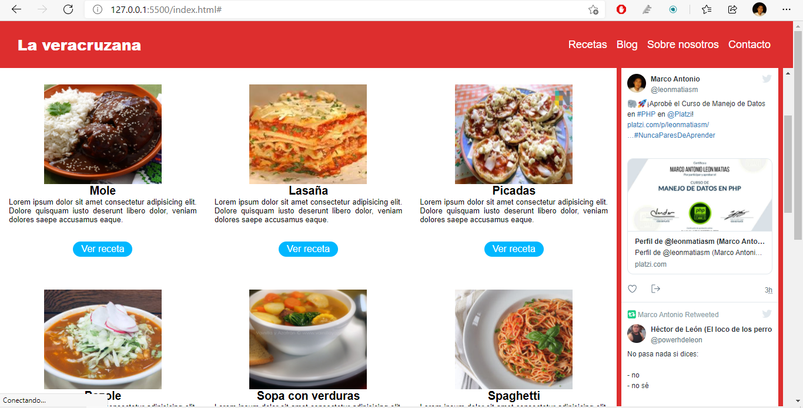

<h1>Repaso de HTML y CSS grid</h1>

Solo es una pequeña practica. Apliqué lo aprendido en platzi.com para hace una página web sobre recetas 
de comida.

</img>

Soy Marco Antonio y sigo aprendiendo👍

